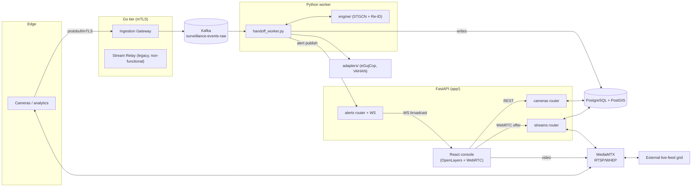

# TRINETRA — Architecture

Gujarat Police multi-department CCTV integration platform. Target scale: 80,000+ cameras across Police, RTO, GSRTC, Civil Supplies, Revenue, and private feeds. One initial commit (`522d903`) plus in-progress work adding external live-feed grid integration and console fixes.

Invariants held everywhere: coordinates WGS84 / EPSG:4326 (lon,lat order at API boundaries, projected to EPSG:3857 only inside OpenLayers); timestamps UTC epoch **milliseconds**, int64; detection embeddings fixed at 512 dims.

---

## 1. High-level architecture

---

## 2. Component breakdown

### 2.1 FastAPI service — `app/`

**Entry & lifecycle** (`app/main.py`): JSON-line logging with request-id correlation via `ContextVar`; lifespan connects the asyncpg pool (unguarded — startup aborts if DB is down) and starts the stream keepalive loop; CORS restricted to configured origins, `GET/POST/OPTIONS` only; uniform error envelope `{detail, errors?, request_id}` for validation errors, Postgres errors (503, sqlstate only, never DSN/SQL), and pool-not-ready (503); `GET /health` does a real `SELECT 1`.

**Routers**:
- `cameras.py` → `/api/v1/cameras` — CRUD, spatial radius search (`ST_DWithin` + geography index), batched health-ping ingestion. Camera geometry stored as PostGIS `GEOMETRY(Point,4326)`, always projected back to scalar lat/lon at the boundary.
- `streams.py` → `/api/v2/webrtc/offer` — the only stream-playback endpoint. Decides MediaMTX-pull vs legacy-relay backend, negotiates WHEP by POSTing raw SDP, manages on-demand MediaMTX paths (`cam-<uuid>`, `sourceOnDemand: true`), tracks sessions in `relay_sessions`, and runs a background keepalive/heartbeat loop. Never accepts a client-supplied RTSP URL — always resolves from the DB.
- `alerts.py` → `/api/v1/alerts/publish` (POST) + `/alerts/p0` (WebSocket) — persists to `threat_alerts` (idempotent on `alert_id`) then broadcasts to every subscribed console socket. Gated by a single shared `P0_ALERT_API_KEY` (open if unset); WS accepts the key via `?token=` because browsers can't set WebSocket headers.

**Config** (`app/config.py`): pydantic-settings `Settings`, `.env`-driven, cached singleton. Groups: app/DB/HTTP limits, Kafka, ML engine tuning (similarity/handoff thresholds, cooldowns, TTLs), external registries, alerts, MediaMTX, **live grid** (`LIVE_GRID_*` — catalogue URL, HLS base, media host, RTSP port, email/password, camera-id range), and relay/mTLS settings. Derived properties include `media_backend` (mediamtx wins over relay), `live_grid_media_hosts` (a credential-injection allowlist — the actual security control), and `live_grid_camera_id_list` (expands ranges like `cam01-cam30`).

**Database** (`app/database.py`): no ORM — raw SQL over a single process-wide `asyncpg` pool. Sets `TIME ZONE UTC` per connection, verifies `PostGIS_Version()` on connect. Migrations are plain idempotent SQL files in `sql/`, applied by `scripts/migrate.ps1` — no Alembic, no version table.

**Schemas** (`app/schemas.py`): pydantic v2 contracts for every request/response, with `extra="forbid"` on writes, constrained lat/lon/azimuth/FOV types, and scheme allowlisting on stream URLs.

### 2.2 ML engine — `engine/` + `workers/`

No detector/ANPR/Re-ID extractor lives in this repo — embeddings and plate reads arrive pre-computed on the Kafka bus from edge analytics.

- `engine/tracking_pipeline.py` — builds a spatial camera graph from PostGIS (nodes = active cameras, edges = `ST_DWithin` self-join done in Postgres to avoid an O(n²) in-process scan at 80k-camera scale). A 3-layer GCN (`torch_geometric`) + GRU scores next-camera probability, multiplied by a temporal Gaussian term and a directional-cosine term. **Weights are randomly initialized — no trained checkpoint exists**, so scores are wired correctly but not yet meaningful.
- `engine/vector_matcher.py` — cosine similarity Re-ID matcher over 512-dim embeddings, plus a per-camera finite-state machine: `PASSIVE → PRE_ACTIVATED → ACTIVE_TRACKING → COOLDOWN → PASSIVE`.
- `workers/handoff_worker.py` — the driver: an async Kafka consumer (manual offset commit, so poison messages can't wedge a partition) decodes events, assigns/matches Re-ID targets, updates tracks and camera states, screens plates, and publishes alerts; a parallel scheduler tick runs handoff prediction (time-dependent, so it lives in the scheduler, not at detection time) and periodic graph reload.
- `workers/seed_transition_stats.py` — batch job computing median inter-camera transit times from historical detections, feeding the temporal term above.

### 2.3 External registry adapters — `adapters/external_db_bridge.py`

Async HTTP/2 clients (pooled, bulkheaded, jittered-retry) to eGujCop/CCTNS (criminal/stolen-vehicle lookup) and VAHAN (registration lookup, owner name masked before it can reach the console). Falls back to deterministic simulation when no base URL is configured. `AlertDispatcher.build_alert` derives a SHA-256-based idempotent `alert_id` and priority; alerts are actually delivered over HTTP to the FastAPI publish endpoint, not the dispatcher's own WebSocket path (present but unused, to avoid double delivery).

### 2.4 Go tier — `cmd/`

- **Ingestion gateway** — mTLS-terminated HTTP endpoint accepting protobuf-encoded detection events (≤2MB), lightly validates only a few tags with `protowire`, mints an event_id if missing, and produces the raw bytes onto Kafka keyed by department code.
- **Stream relay** (legacy) — mTLS media relay that dials RTSP and spawns ffmpeg per session. Documented as non-functional for media today; MediaMTX is the real video backend (`media_backend` config prefers it because it's the only piece implementing ICE/DTLS/SRTP).

### 2.5 Media plane — MediaMTX

RTSP ingest (8554), WebRTC/WHEP signalling (8889) + UDP media (8189), admin API (9997, loopback-only, anonymous). Config (`mediamtx.yml`) disables local HLS and pins WebRTC host advertisement to avoid ICE candidate mismatches, since the console posts its SDP offer before ICE gathering completes and never trickles candidates.

**External live-feed grid** (new): a third-party CDN + static-IP host serving a camera catalogue, HLS, and RTSP/WHEP. Registered like any other camera, but credentials are never stored — `streams.py:_with_grid_credentials` injects them into the RTSP URL in memory, only for hosts on the `live_grid_media_hosts` allowlist, at the moment of dialing MediaMTX.

### 2.6 Frontend — `frontend/`

React 18 + Vite 5, deliberately minimal: no router, no Redux/Zustand, no axios, no UI kit, no TypeScript. `App.jsx` is a thin shell; `GISMap.jsx` (840 lines) is effectively the whole application.

- **Map**: OpenLayers 9 over OSM raster tiles. Camera markers are inline-SVG, colored by department, built once and cached. Trajectory layer redraws a `LineString` + numbered hit points per alert, with an animated dash ("marching ants") drawn in a `postrender` handler — entirely outside React's render cycle.
- **State discipline**: high-frequency data (camera positions, live alerts) mutates OpenLayers `VectorSource`s directly via refs; `useState` is reserved for UI chrome that must actually re-render. Callback refs (`onAlertRef`, `closeStreamRef`) keep the map's bootstrap effect stable across renders.
- **Video**: WebRTC only (no hls.js). `RTCPeerConnection` with recvonly transceivers, hardcoded public STUN, negotiates against `/api/v2/webrtc/offer`; tracks are stopped before `peer.close()` to avoid a lingering decoder/session.
- **Alerts**: `WS /alerts/p0` with the API key appended once as `?token=`; exponential-backoff reconnect with jitter, but close code 1008 (policy violation) stops retrying immediately and surfaces "unauthorised" instead of looping silently.
- **Registry HUD**: distinguishes failed fetch / empty registry / rows lacking coordinates, so a blank map is diagnosable.
- No CSS framework — global reset + inline JS style objects.

### 2.7 Storage

**PostgreSQL 16 + PostGIS 3.4**, 9 tables, no ORM:
`departments` (6 seeded rows, ids match protobuf enum names) · `cameras` (geometry + azimuth/FOV/stream_url/status, GIST-indexed on both geometry and geography casts) · `camera_health_logs` · `camera_transition_stats` (feeds the temporal handoff term) · `detections` (event_id PK for idempotency, deliberately **no FK** on camera_id so a registry gap can't drop evidence) · `target_embeddings` (plain `REAL[512]`, not pgvector — scoring happens in torch) · `camera_wake_state` (mirrors the in-process FSM) · `threat_alerts` (SHA-256-derived id, priority P0–P3) · `relay_sessions`.

**Kafka** — single-node KRaft, topic `surveillance-events-raw`, keyed by department code, manual consumer offset commit.

**No Redis/cache layer, no object storage.** All caches (active-target embeddings, registry lookup TTL caches, WS subscriber set) are in-process only — durable state that survives a worker restart lives in `target_embeddings`/`camera_wake_state`, but a second worker replica would not share live FSM state. Video is pass-through only; nothing is recorded.

---

## 3. End-to-end data flows

**Camera registration** — `POST /api/v1/cameras` → schema validation (scheme allowlist, code uppercasing) → insert with `ST_MakePoint(lon,lat)` → FK/unique violations mapped to 400/409. Grid cameras are registered credential-free by `scripts/register_grid_cameras.ps1`; credentials are injected only at dial time server-side.

**Console load & live playback** — console fetches the full camera list, draws markers → operator clicks a camera → health poll → "play" opens an `RTCPeerConnection`, POSTs an SDP offer to `/api/v2/webrtc/offer` → API resolves the camera's real `stream_url` and status from the DB (never trusts the client), ensures a MediaMTX on-demand pull path if needed, injects grid credentials if applicable, negotiates WHEP, returns the SDP answer → media flows UDP directly from MediaMTX → a background loop ages out and tears down idle sessions.

**Detection → Re-ID → handoff** — edge analytics POST protobuf to the Go ingestion gateway over mTLS → gateway lightly validates and produces raw bytes to Kafka → `handoff_worker` decodes, enforces the 512-dim embedding contract, matches or mints a Re-ID target identity, updates track velocity/heading, persists the detection, advances camera FSM states (confirm/expire), separately runs STGCN-based prediction on a scheduler tick to pre-activate downstream cameras.

**Plate → alert** — if a plate is present, concurrent eGujCop + VAHAN lookups run → `AlertDispatcher.build_alert` returns an alert only on a real hit, with an idempotent SHA-256 id → published over HTTP to `/api/v1/alerts/publish` → persisted then broadcast over the alert WebSocket → console mutates its map state directly from the incoming frame.

**Health telemetry** — a fleet poller (not present in-repo; the endpoint is the contract) batches pings to `/api/v1/cameras/health-ping`, transactionally written, then read back per-camera by the console popup.

---

## 4. Recent changes (uncommitted, since `522d903`)

**Theme A — external live-feed grid integration.** Lets TRINETRA treat a real third-party live CCTV grid as first-class cameras with zero local publishing (no ffmpeg containers, no stored video). New `.env` `LIVE_GRID_*` block is the single source of truth, read identically by `app/config.py` and the new `scripts/register_grid_cameras.ps1` (catalogue fetch with graceful fallback, ring placement around a center point, loopback-collision guard, idempotent registration). Credential handling is the key design decision: passwords never enter Postgres or any API response — `app/routers/streams.py:_with_grid_credentials` injects them into the RTSP URL in memory only, gated by an explicit host allowlist, at the moment MediaMTX is dialed.

**Theme B — console usability & alert-socket auth.** Fixes a silent failure mode where a 403/1008 on the alert WebSocket looped forever as "reconnecting" — now the console stops retrying on close code 1008 and shows "unauthorised - check VITE_P0_ALERT_TOKEN". Adds registry HUD diagnostics (failed fetch vs. empty registry vs. undrawable rows) and a "Fit cameras" button. New `frontend/.env.example` documents the shared dev alert token, which must match the backend's `P0_ALERT_API_KEY`.

README was restructured to document both grid-based and local-file live-video testing paths, with new troubleshooting rows for each failure mode above.

---

## 5. Known limitations

- STGCN handoff model has random (untrained) weights — probabilities are not yet meaningful.
- Legacy Go stream relay's media path is non-functional; MediaMTX is the only working video backend.
- Alert delivery via 202 response is not durable — no retry/DLQ if the console misses a broadcast.
- Single shared alert API key; dev-only PKI for the Go services' mTLS.
- No user authentication/authorization anywhere — camera CRUD and WebRTC offer endpoints are fully open; only the alerts channel and Go services have any secret/cert gating.
- Worker is single-replica by construction (in-process FSM/cache, no cross-instance coordination).
- Bearing/geometry math is planar, not geodesic, at small scale (acceptable at city scale, noted as a limitation at range).

---

## 6. Deployment

`docker-compose.infra.yml` runs **infrastructure only** — `postgis/postgis:16-3.4`, `apache/kafka:3.7.1` (KRaft), `bluenviron/mediamtx:1.9.3` (no healthcheck possible — scratch image, no shell) — all ports bound to `127.0.0.1`. FastAPI, the handoff worker, and the Vite dev server run natively on the host. No Dockerfile, no k8s manifests, no CI config exist yet.

**`scripts/`** — paired `.ps1`/`.cmd` for every operation: `gen_dev_certs.ps1` (dev mTLS PKI via containerized openssl), `gen_proto.ps1` (protobuf codegen), `migrate.ps1` (applies `sql/*.sql` via psql inside the postgres container), `publish_videos.ps1` (loops local test video files into MediaMTX via containerized ffmpeg), `register_video_cameras.ps1` (registers those local test streams as cameras), `register_grid_cameras.ps1` (registers external grid cameras — see Theme A), `publish_test_event.py` (pure-Python stand-in for the Go gateway, for exercising the detection pipeline without real edge hardware).
